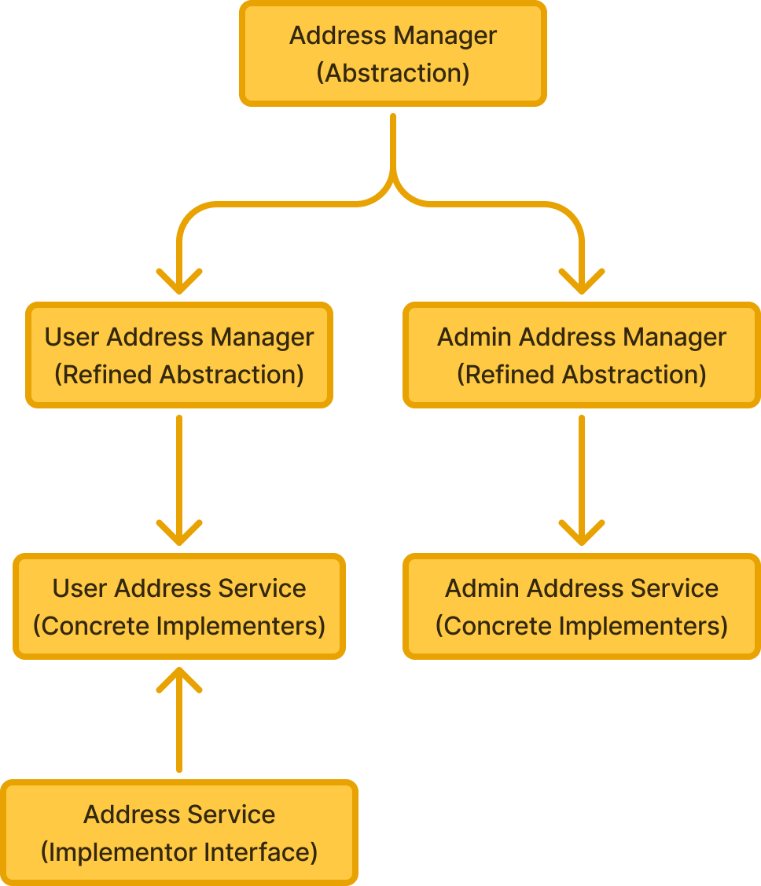
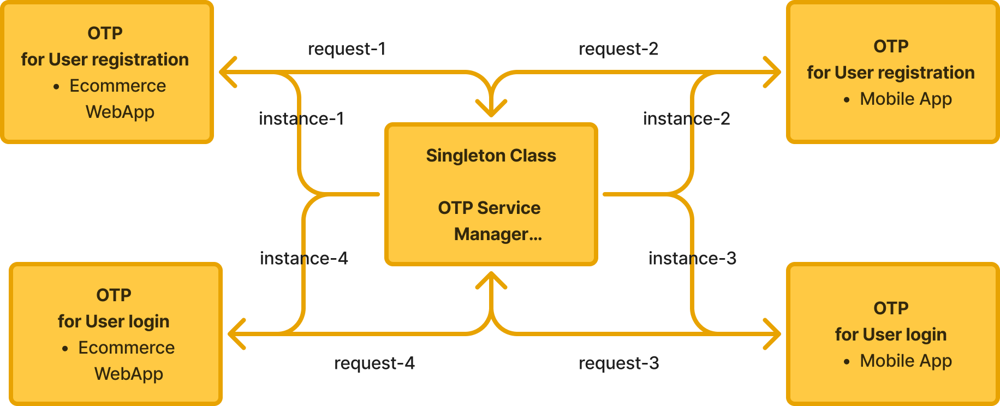
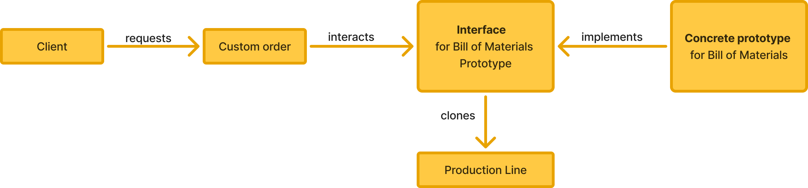
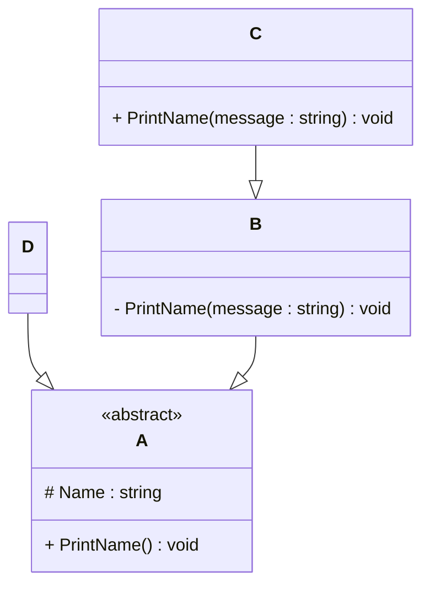

# Programming Test

- By Sami Sayed

---

## Exercise 1

### Task
Write a program in the language of your choice where:

1. The iteration number (starting from 1), followed by a random number between 1 and 100, is printed 100 times.
2. After every 5 iterations, write an additional separator (e.g., `---`).
3. Write “Lucky number!” after every random number that is divisible by 7.

> Try to keep the procedure as short as possible.

```
#Javascript
for (let i = 1; i <= 100; i++) {
    const randomNumber = Math.floor(Math.random() * 100) + 1;
    console.log(`${i}${randomNumber}`);

    if (randomNumber % 7 === 0) {
        console.log("Lucky number!");
    }

    if (i % 5 === 0) {
        console.log("---");
    }
}
```
---

## Exercise 2

### 1. **What is your understanding of the term “Design Patterns”?**  

A Pattern that can solve specific issues in software development and which can be applied to recurring problems is termed as a design pattern.

These patterns are mostly defined by developers who had the experience, insights and are also time-tested.


### 2. **Explain the MVC Pattern**  
   - What does MVC stand for?  
      - MVC stands for Model View Controller.

   - Explain the pattern in detail.  
      -  The MVC software architectural pattern provides a solution to sperate the business logic and the display parts of an application by dividing the code into three parts:
         1. Model
         - Represents data and business logic.
         - Interacts with the database.
         - Example: A Brand class representing a table in your database.
         2. View
         - Responsible for the UI (User Interface).
         - Usually HTML pages, or front-end frameworks.
         - Displays data to the user.

         3. Controller 
         - Allows the developer to control the communication between models and views in the MVC.
         - Receives requests, processes them (with help from the Model), and returns the appropriate View.
         - Example: When a user clicks "Logout", the controller handles that request.
      - Advantages of using the MVC :
         - It isolates the logic, presentation and the data.
         - Multiple teams can collaborate easy or also work indepedently on the three different parts.
         - Components are reusable.
         - Testing and debugging can be done on individual units.
         - It enables modularity and makes it easy to extend the code.


   - What are some use cases for this framework?
      - There are many use cases for the MVC framework :
         - Content management systems
            - Example: A portfolio website for a company with a front-end website and admin panel. Data feeded in the admin panel is reflected on the website via the MVC.

         - E-commerce Platform 
            - Example: A Jewelry Online store with features like wishlist, order management, shipping, address book, user profile management, payment gateway, invoicing etc.

         - Learning management systems
            - A platform with features like student tracking, assignments, and online quizzes.


### 3. **List three other design patterns**  
   - Provide names and details for three additional design patterns.

   1. Bridge 
      - Bridge is a structural design pattern that lets you split a large class or a set of closely related classes into two separate hierarchies—abstraction and implementation—which can be developed independently of each other.
      - Abstraction (also called interface) is a high-level control layer for some entity. This layer isn’t supposed to do any real work on its own. It should delegate the work to the implementation layer (also called platform).
      - The abstraction can be represented by a graphical user interface (GUI), and the implementation could be the underlying operating system code (API) which the GUI layer calls in response to user interactions.


         Use case for Bridge:

         - In an e-commerce platform where both users and admins need to manage address books:
            - Users manage their own shipping and billing addresses.
            - Admins may update addresses for users.

         - Abstraction: AddressManager

         - Refined Abstractions: UserAddressManager, AdminAddressManager

         - Implementor Interface: AddressService

         - Concrete Implementors: UserAddressService, AdminAddressService

</br>
</br>


</br>
</br>


We want to allow both users and admins to operate on address data but through their own logic and permissions — without tightly coupling the logic to the UI or storage mechanism.


   2. Singleton Pattern
   Ensures a class has only one instance and provides a global point of access to it.
   Managing access to resources such as database connections, file systems, or logging services.
   A class keeps a private static variable that holds its only instance.
   The constructor is made private or protected.
   A public static method (e.g., getInstance()) returns the instance, creating it if it doesn't exist.

         Use case for Singleton : OTP Service Manager
         A company provides user authentication services for both its mobile application and e-commerce website using mobile number and OTP verification. Every time a user registers or logs in, OTPs are generated, sent, and verified individually. Managing these processes separately across platforms was inefficient, led to code duplication, and increased the chances of inconsistency.
         Hence, we developed a Singleton-based OTP Service Manager, which acts as a centralized component for generating, storing, sending, and verifying OTPs across both platforms. This ensured consistent behavior, reduced redundant code, and improved maintainability while streamlining the authentication process.

   </br>
   </br>

   

   </br>
   </br>

   3. Prototype 
   The Prototype Design Pattern is a creational pattern that allows the creation of new objects by copying an existing object. it also hides the complexity of making new instances from the client. The existing object acts as a prototype and contains the state of the object.

         Use Case for prototype :
         Manufacturing ERP system for Motors
         A company manufactures customized motor as per the given specifications by the client. The specifications are taken into details and a bill of material is created everytime a new order is in place. Creating raw material requirements is very time-consuming and error-prone for every order.    
         Hence, we created a prototype for Bill of Materials. So that when a custom order comes in we only cloned the prototype and modified the necessary parameters like inlet size, delivery time, grade of material etc.

   </br>
   </br>
   
   

   </br>
   </br>
   
---  

## Exercise 3

### 1. **Implementation Task**  
   Based on the class diagram below, provide an implementation in any object-oriented programming language of your choice.
   



```
# Answer
#include <iostream>
#include <string>
using namespace std;


class A {
protected:
    string Name;

public:
    virtual void PrintName() = 0; // pure virtual function
    virtual ~A() {} // virtual destructor
};

// D -> A
class D : public A {
public:
    D(const string& name) {
        Name = name;
    }
    void PrintName(){
        cout<<"Hello A:"<<Name<<endl;
    }
};

// B -> A
class B : public A {
private:
    void PrintName(const string& message) {
        cout << message << ": " << Name << endl;
    }

protected:
    void TestPrintName(const string& message) {
        PrintName(message); // way to use private method in derived class
    }
};

// C -> B
class C : public B {
public:
    C(const string& name) {
        Name = name;
    }

    void PrintName(const string& message) {
        TestPrintName(message);
    }

    void PrintName() override {
        cout << "C Name: " << Name << endl;
    }
};


int main() {

    D dObj("Yash");
    dObj.PrintName();

    C cObj("Selina");
    cObj.PrintName(); // calls overridden PrintName()
    cObj.PrintName("Car"); // calls message-based PrintName()

    return 0;
}
```

### 2. **Key Questions**  
   - Are you able to directly create a new instance of `ObjectA`? Please explain your answer. 
      - No, We cannot create a new instance of class `ObjectA` because it is an abstract class.Due to the incomplete nature and design principles of abstract classes they cannot be instantiated.
   
   - Given an instance of `ObjectC`, are you able to call the method `PrintMessage` defined in `ObjectB`? Please explain your answer.  
      - **No**, we cannot call the method `PrintMessage` defined in `ObjectB` because the method `PrintMessage` is declared as private which means it cannot be used outside of `ObjectB` 
      </BR>
      **but** in a situation where another function which is created inside the class of `ObjectB` is public and calls the private `PrintMessage` function, in that situation it is possible to indirectly call the private `PrintMessage` function defined in `ObjectB`.

   - Try to explain as many key features of object-oriented programming as you can find in this example.
      - On of the top most feature is Abstraction : 
         - The class which is defined with the abstract keyword is the Abstract Class in Java. It can have abstract methods, concrete methods, and instance variables. The abstract method in Java is the one that is only declared but does not have any implementation. Whereas normal methods have an implementation. An abstract class is used as a blueprint for other classes to extend and implement abstract methods.
         - In this example `ObjectA` is an example of abstract class

      - Encapsulation 
         - It refers to the practice of hiding the internal state and behavior of an object from the outside world and only exposing a limited set of methods and properties that allow external objects to interact with it. This helps in maintaining the integrity and consistency of the data, and it also makes the code more maintainable and less prone to errors.
         - Encapculation is implemented here by the protected keyword which is an access modifier used by `ObjectA`.
      
      - Inheritance 
         - It allows classes to inherit properties and behaviours from other classes. Through inheritance, a subclass can reuse and extend the features of a superclass, creating a hierarchical relationship between classes. This promotes code reuse, modularity, and the ability to create specialized classes based on existing ones. Inheritance is achieved using the extends keyword, where a subclass inherits its superclass’s fields, methods, and constructors and can add its unique characteristics or override inherited methods to customise its behaviour.
         - ObjectD and ObjectB inherit from ObjectA.
         - ObjectC inherits from ObjectB, forming a chain: ObjectA → ObjectB → ObjectC.
         - This allows ObjectC to reuse and extend the logic of ObjectA and ObjectB.

      - Method Overloading
       - It is the ability to create methods with the same name but with different types of parameters. Method Overloading helps the developer in achieving Compile Time Polymorphism.
       - In the example : ObjectC has a function PrintName(string) that overloads the function.


      - Method Overridding
       - It allows developers to create new implementations for the methods that already exist in the parent class. This is done by defining a method in the child class with the same name and the same signature in the parent class.
       - In the example : ObjectC overrides ObjectA’s pure virtual function PrintName()

     

---

## Exercise 4

### Maintaining and Expanding Software for Component Validation

This exercise focuses on strategies for working with existing code bases and ensuring the software remains maintainable as new features and requirements are introduced.

### 1. **Working with Existing Code**  
- How would you approach understanding and contributing to an existing code base with minimal disruption?  
- What practices would you follow to ensure your changes integrate well with the current structure?  

   - The appropriate approach for understanding the existing code base would be : 
      - Reading the documentation
      - Running the code on local environment or test branch 
         - Set up the codebase locally and get it to run.
      - Using it like a user 
      - Understand the finished product myself 
      - Ask Questions & take notes
      - Check for bugs and error messages
      - Performing unit tests on existing features

   - The appropriate practises to ensure that the changes integrate well with the current structure are: 
      - Following the same coding style and using the same predefined vaariables
      - Avoid duplicating the code or variables.
      - Find and re-use the components
      - Make small changes
      - Maintain versioning of code 
      - Perform unit tests for every version
      - Double check before commiting the changes 
      - Documenting the changes and versions


### 2. **Ensuring Maintainability**  
- What techniques would you use to keep the code base clean, modular, and easy to maintain as new features are added?  

   - Following the same style of coding
   - Re-using components
   - Creating components which could be reusable in future
   - Document each version with details of features

- How would you handle code documentation and testing to support long-term maintainability?  
   - Code Documentation :
      - Distirbuting the documentation for each developer 
      - Making sure the developer updates the code documentation on the go.
      - Collecting the information from all the developers and organising them to prepare the final code documentation
      - Adding proper indexing and structure of the information for better understanding and readability

   -  Code testing 
      - Every developer upon development with perform unit tests by themselves
      - Also they will add their notes for unit tests performed and pass them to the software tester
      - Sofware tester will perform manual and automation testing for the code or components
      - Sofware tester will record the bugs in a structured manner as logs
      - Allowing the developer to re-work on the code and repeat the above process for bug resolution.
      

### 3. **Balancing Flexibility and Stability**  
- How would you design or refactor the software to make it flexible for future changes while ensuring the existing functionality remains stable?  
    - By applying the microservices architecture that allows us to practice modularity, fault isolation and decoupling.
- Which design patterns or principles would you apply to achieve this balance
    - Creating seprate backend services for different types of clients, such as desktop and mobile. That way, a single backend service doesn't need to handle the conflicting requirements of various client types. This pattern can help keep each microservice simple, by separating client-specific concerns.
    - Isolates critical resources such that a single workload (or service) can't consume all of the resources, starving others
    - Desing Patterns 
      - Adapter Pattern : Helps integrate new components with existing ones without changing existing code.
      - Proxy Pattern : Useful for adding layers like caching, logging, or access control without touching business logic.
      - Strategy Pattern : Makes business rules replaceable at runtime.
      - Singleton : Ensures a single shared instance, e.g., for logging, configuration, or cache.
      - API Gateway Pattern : Central entry point for microservices.
      Also to balance stability and scalability we could use structural and behavioral patterns to manage complexity and distributed system patterns.
---
